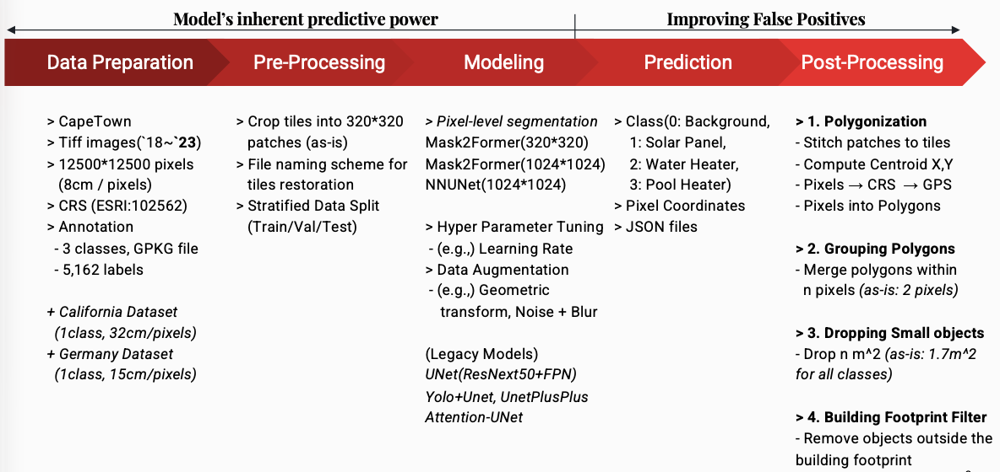
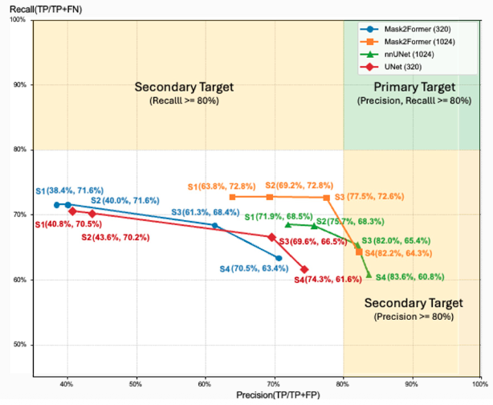

# Energy Transition During Energy Crisis: Cape Town's Experience
### Multi-Class Computer Vision Model for Solar Home Energy System Detection

As of Dec.01

**Overview**

* This project builds a **computer vision pipeline** to detect rooftop **solar home energy systems** in Cape Town, South Africa. Because of load-shedding, many households have added private solar installations, but only around one-third are formally registered. The model classifies **three types** of systems(solar panels, solar water heaters, and solar pool heaters), and estimates their **locations** and **sizes** to approximate total generation capacity. These insights can help study energy inequality and how rooftop solar is distributed across the city.

**Dataset**

* This consist of **aerial imagery** from 2018 to 2023 covering **Cape Town**. Each image is a tile at 12,500 × 12,500 pixels (8 cm per pixel), with roughly 2,800 tiles per year. For model training, only 15 annotated images from 2023 were used, containing 5,162 annotations: *2,033 solar panels, 1,983 solar water heaters, and 1,146 solar pool heaters*. Each tile was cropped into **1,024 × 1,024 patches**, with padding to handle the remaining borders.

**Modeling**

* Mask2Former architecture is used for pixel-level segmentation. The model is built on the Swin-Small Mask2Former ADE-semantic encoder, which helps the model recognize rooftop textures, edges, shadows, and surface patterns before fine-tuning on the Cape Town dataset. The model predicts four classes (Background, Solar Panel, Solar Water Heater, and Solar Pool Heater) and is trained with a learning rate of 0.0003, weight decay of 0.0001, 100 epochs, and cross-entropy loss only. Mask2Former performs end-to-end semantic segmentation, generating pixel-wise predictions for all rooftop system types.

**Post-processing**

* These segmentation outputs are polygonized and are merged with geospatial data to create instance-level information, including GPS and CRS coordinates, and surface area(m^2). This process allows the model to identify rooftop locations and quantify solar panel areas for further analysis.
<br>
* The post-processing workflow is as follows: <br>
    * Step1. **Polygonization**: Adjacent pixels belonging to the same predicted class are grouped into polygonal objects. <br>
    * Step2. **Grouping adjacent polygons**: To reconnect objects split across tile boundaries, polygons within 2 pixels of each other are merged if they belong to the same class. <br>
    * Step3. **Small-object removal**: Small detections (≤ 1.7 m²) are removed to eliminate noise. <br>
    * Step4. **Building-footprint filtering**: Predictions falling outside external building-footprint polygons are removed to ensure detections correspond to actual rooftops. <br>
    
-----



-----

**Test result**
* Three different models were evaluated, including Mask2Former with a 1024 × 1024 input size as described above.
* The Mask2Former (1024 × 1024) model, combined with Post-processing Steps 1, 2, and 3 produced the most balanced results.
* Its overall performance was: *'Precision' = 77.51%, 'Recall'= 72.64%*
* For more details, please refer to `4.Post-Processing/Post-Processing with Evaluation/Readme.md`



*Remarks: S1 = Step1, S2= Step1+2, S3=Step1+2+3, S4=Step1+2+3+4*

**File Structure** 

```
├─ 0.Data_Preparation
├─ 1.Pre-Processing
├─ 2.Modeling
│  ├─ Mask2Former
│  │  ├─ 1024*1024
│  │  ├─ 320*320
│  ├─ Unet(Legacy)
│  └─ nnUnet(Legacy)
├─ 3.Prediction
│  ├─ Mask2Former
│  ├─ Unet(Legacy)
│  └─ nnUnet(Legacy)
├─ 4.Post-Processing
│  ├─ Post-Processing with Evaluation
│  └─ Post-Processing_Scaleup
└─ requirements.txt

```
**Visualization**


